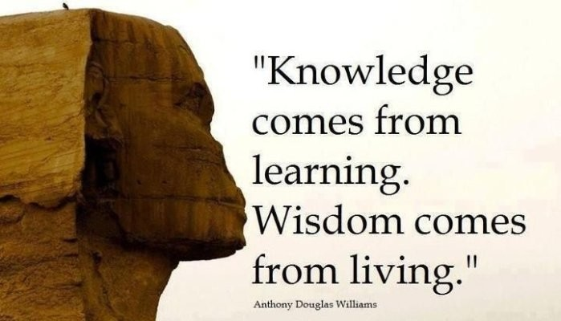

# MindBot AI

Welcome to **MindBot AI**, your best AI assistant! This application offers multiple features, including chatbot functionality, text-to-speech, speech-to-text, AI translation, OCR (Optical Character Recognition), background removal, and QR code generation.

## Features

- **Chatbot**: Interact with an AI chatbot using OpenAI's GPT-3.5 Turbo model.
- **Text-to-Speech (TTS)**: Convert text input into spoken audio.
- **Speech-to-Text (STT)**: Convert spoken audio into text.
- **AI Translator**: Translate text into various languages using a translation API.
- **Text OCR**: Extract text from images.
- **Remove Background**: Remove the background from images using the Remove.bg API.
- **Generate QR Code**: Create QR codes from text or URLs.

## Installation

To install the required packages, follow these steps:

1. **Clone the repository**:
   ```bash
   git clone https://github.com/AhmedHelmyAli/Mindbot-Ai-CS50-finalproject.git
   cd Mindbot-Ai-CS50-finalproject
2. **Create a virtual environment**
   ```bash
   python -m venv venv
   source venv/bin/activate  # On Windows use `venv\Scripts\activate`
3. **Install the required packages:**
   ``bash
   pip install -r requirements.txt
4. **Set your OpenAI API key in the code**
   ```bash
   openai.api_key = 'ENTER-YOUR-API-KEY-HERE'
5.**Run the application:**
  ```bash
  python main.py


**Usage**
After running the application, you will be prompted to choose a command from the available features. Follow the on-screen instructions to interact with each feature.

**Images**
### Example of Text OCR
Before:


After:
**Knowledge
comes from
learning.
Wisdom comes
from living.**

Anthony Douglas Williams

### Example of Background Removal
Before:


After:


###License
This project is licensed under the MIT License - see the LICENSE file for details.

###Acknowledgments
OpenAI for the ChatGPT API.
PyTTSx3 for text-to-speech conversion.
SpeechRecognition for speech recognition capabilities.
Translate for translation functionalities.
Pytesseract for OCR capabilities.
Remove.bg for background removal API.
qrcode for QR code generation.
